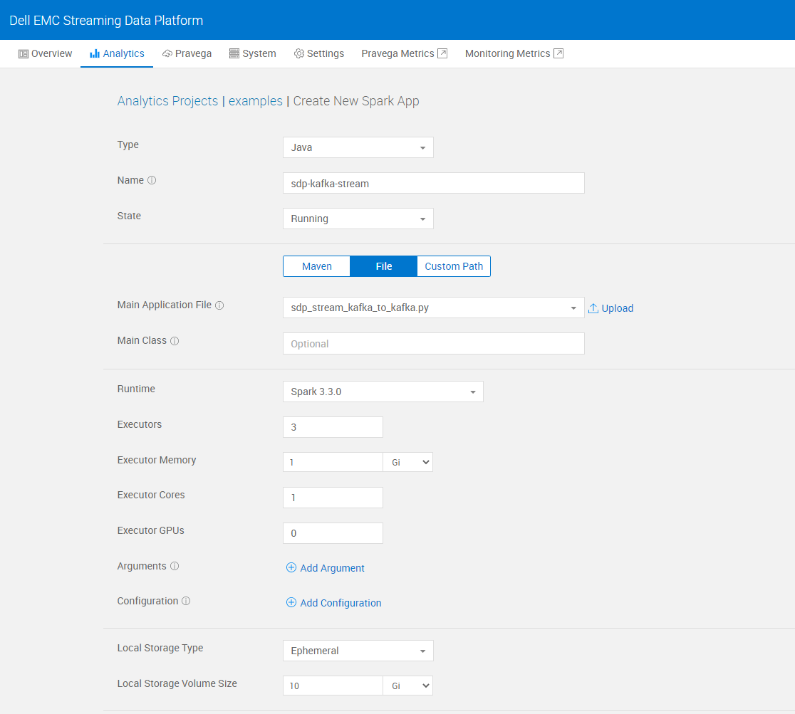
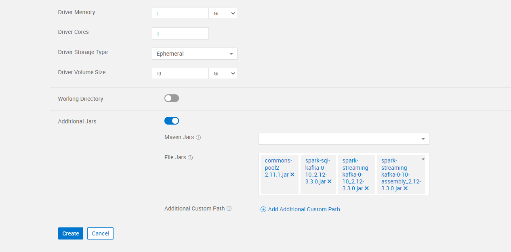
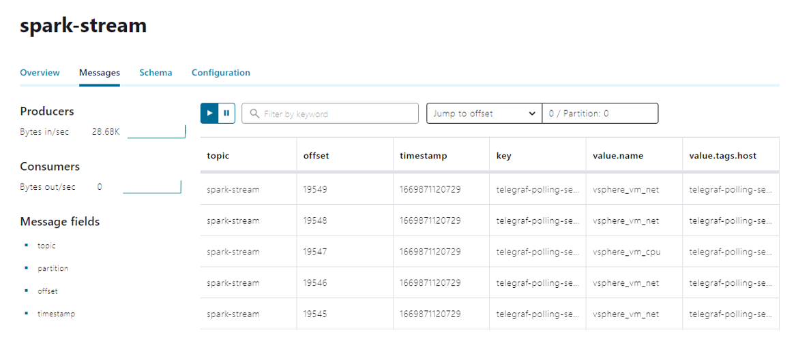

#  Spark application example to read and write to kafka streams from SDP

This code sample demonstrates the capabilities of spark application created on SDP that can be used to read data from one kafka topic and write to another kafka topic.

## Dependencies
* commons-pool2-2.11.1.jar
* spark-sql-kafka-0-10_2.12-3.3.0.jar
* spark-streaming-kafka-0-10_2.12-3.3.0.jar
* spark-streaming-kafka-0-10-assembly_2.12-3.3.0.jar

## Deployment
1. Create a project on SDP UI.
    - Git clone the repository for SdpKafkaStreamingUsingSpark.
    - Update sdp_stream_kafka_to_kafka.py with correct kafka server and input topic details.

2. Upload sdp_stream_kafka_to_kafka.py and all the other dependencies from jar-files folder into the artifacts on SDP UI.

3. Create a Spark application. Upload the sdp_stream_kafka_to_kafka.py file as the main application file and provide mentioned spark configurations and dependencies.  

4. Once the application starts running, spark application will be able to read messages from one kafka topic and write to another Kafka topic.

5. In order to visualize these kafka streams, there are various tools available. Since we are using confluent kafka, it comes in-build with Confluent control center which can be used to visualize kafka data streams. Currently, SDP UI does not provide a capability to visualize these streams on streaming data platform.

6. Input kafka stream consumed by spark application on SDP.

7. Output kafka stream produced by spark application on SDP.

